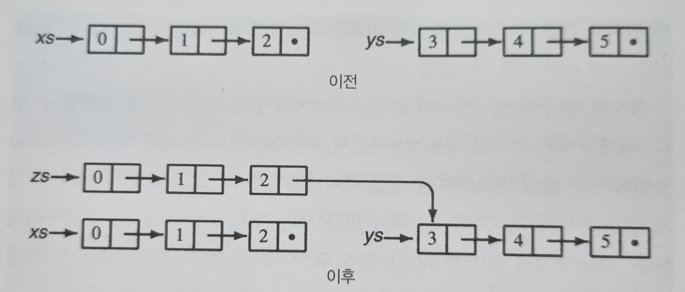
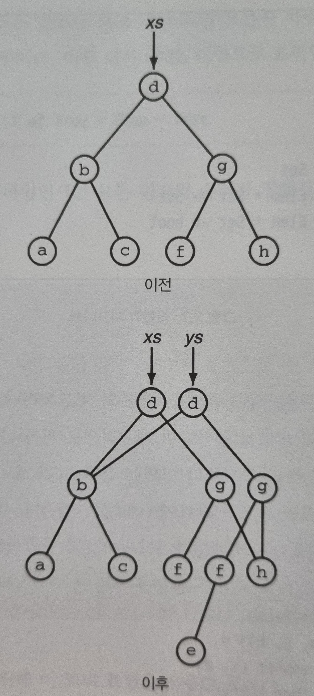

# 02. 영속성

영속성이란 생성한 데이터가 지속적으로 존재하는 것을 말한다. 

함수형 데이터 구조의 특성 중 하나는 영속적이다. 
데이터의 변경이 필요할 경우, 
변경이 필요한 부분에 대해서 복사본을 뜬 후, 해당 복사본에 대해서 데이터를 변경한다. 
즉, 데이터를 갱신하여도 이전 버전이 변경되지 않으며, 새로운 버전의 데이터 구조를 만들고 이전 버전과 공존한다. 

## 영속성 데이터 구조 예시

### 리스트
일반적으로 리스트 xs 와 리스트 ys 를 연결한다고 하였을 때, 
리스트 xs 의 tail 을 리스트 ys 의 head 에 연결하므로 원본 리스트 xs 가 훼손되게 된다. 
(xs.tail = null 이였지만 연결과 동시에 xs.tail = ys.head 가 된다.) 

함수형 데이터 구조에서는 영속성을 지원해야한다. 
따라서, 영속성을 지원할 수 있도록 복사를 통해 리스트 xs 가 훼손되지 않도록 한다. 

또 다른 예로, 
리스트 xs 에서 리스트의 3 번째 node 의 값이 변경되어야할 경우,  
아래와 같이 변경이 필요한 부분에 대해서 복제를 하여 영속성을 지원할 수 있다. 

즉, 함수형 데이터 구조에서는 변경이 필요한 부분에 대해 복제하여 원본 데이터를 유지시켜서 영속성을 지원한다. 

### 이진 검색 트리
마찬가지로 이진 검색 트리도 아래와 같이 연산에 맞게 복제를 통해 영속성을 지원하여 함수형 데이터 구조를 가져갈 수 있다. 
